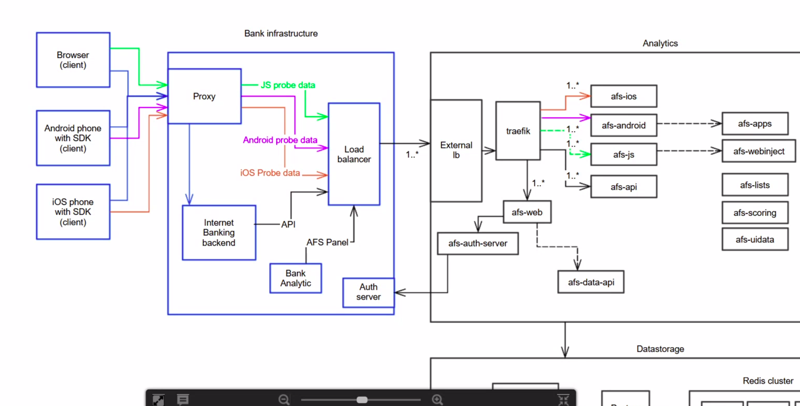
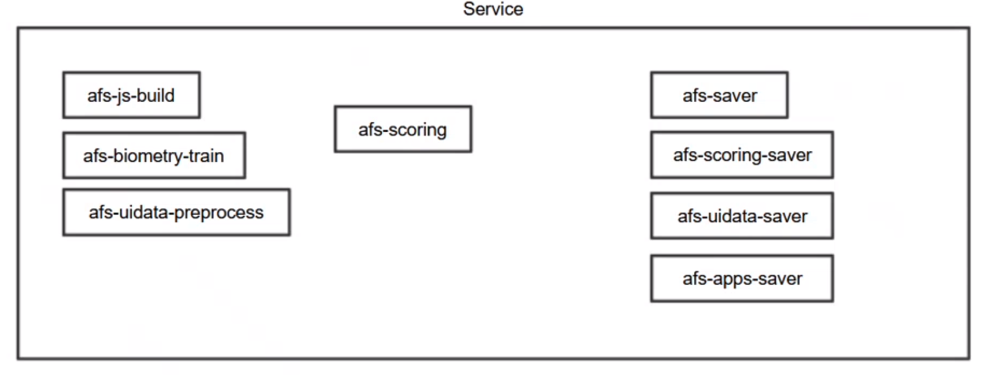
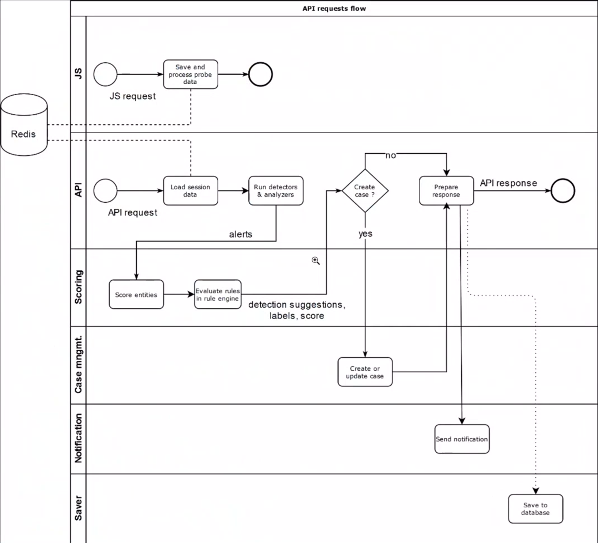

# AFS 
adaptivna autentizacia - banka sa po logine pýta AFS na score 

Identita - FP - otisk zariadenia - web brovser 

### Útoky
***Malware*** - app, čo robi enchcene veci. Na web kanalu pomocou web injectov  - validujeme ich. 
Na telefone - scan applikácii.  - virus total - 3th party blacklist
  
***ATO - acc take over*** -  ake zariadneie, krajina, pohyb myši, provider 
***Phising*** 
- HTTP REFERER - v hlavičke je info o stranke, z ktorej sa tam prešlo\
- okopčená stránka (i s java scriptom) 
- email - falošne emaily sondovane či na nich niekto nepošle phising mail. 

***Biometria*** -stisk kláves, pohyb myšou 

 
###Zber dát 
JS sonda zbiera data  - v prehliadači - zbiera biometric a FP
API integrácia - či sa prihlásil alebo nie - meno, IP , session 

Na mobiloch nieje JS  ale SDK - proba  (.lib)

3 výstupy  
- dashboard panel
- API 
- notifikácia 

### Entity 
- ***TM visit*** - jedna návšteva - ako keby kontajner 
- ***Session*** - banka si určuje - od prihlásenia do odhlásenia 
- ***client*** - 
- ***čísla účtu*** -
- ***platby***  - 
- ***device*** -

Akcia - udalosť, ktora nastala (prihlasenie, paltba, zmena limitu)
 
 
 signal = alert  - detekovane nálezy 
 detekcie -  vela alertov v kope  - určené pravidla - rule engine
 case management - chcem volať zakaznikovi 
 
 
 ## 2. video 
 img
  
 ochrana web browseru - JS sonda  na desktopu na app SDK -> posiela na proxy. 
 U browseru sú dva endpointy. 
 
 Systém: 
 4 typy virtual mašin:
 - ***analitický server*** - spracováva req. od klienta. Jadro appky. Skoruje req. Náročny na CPU, latenciu. 
    8CPU a 20 GB na server. Jeden zákaznich ich ma aj 12. 
 - ***data storage*** - DB - maria + postgress (niektore služby sú na mariu, nektore na postgres). Niekde aj redis. M
    Redis - in memory cache.  Náročny na HDD.
 - ***service*** - mašina s podpornými (node, virtualka) - bežia na nej podporné procesy. CPU môže bežať na 100% celý čas.  
 - ***Cluster*** - Redis je zvlášť na cluster node - 3 nody a z toho je spravený cluster. Data po tretinach.  
 
 Na UAT je 1 analiticky a jeden datastrorage. 
 
 Zákaznikovi sa dodaju holé image a ostatne sa nainštaluje  cez ansible.  
 
 #### Requesty 
 Req. od zákaznika idu na Analytics server. Tie idú cez Load Balancer. Ak nemá banka svoj, použije sa ext. load balancer - rozdeluje req. na viacero nodov. 
 Ext. loadbalancer je haproxy. Rozbaluje SSL -> posiela na analytics nody. 
 Ak banka nemá LB, prepošle sa  na ext. proxy na 1. node. Ten  nejake spracuje a nejake req. pošle  ostatným. 
 Ak banka má proxy/LB, ten to posiela na  všetky ext. proxy a tie si to rozdeluju. Vtedy bežia ext. proxy na všetkých nodoch. 
 (slovenská ma jeden ext. proxy server).
 V LB  sa môžu mapovať adresy. 
 1. prvok je ***traefik*** - LB na kontajnery - škaluje na urovni docer. 
    - afs-ios - req od SDK. V redise založí seesion a buferuje na ňu informácie. 
    - afs-android - obdobne ako afs-ios
    - afs-js - info zo sondy
    - afs-api - IB volá  našu API.Napr. info o loginu. REST API prijme inf. o login stepe. Vytiahne z redisu data a odpovie IB ake je skore. 
  Pred ním je ešte interná proxy, ktora podla portov mení hlavičku req (napr. na afs-ios )
  
  ###služby analytics
  - afs-apps - vyhdnocovanie aplikácii - má svoju DB 
  - afs-webinject  - má svoju DB  
  - afs-lists - udržovanie listov IP addries. - napojene na cloud 
  - afs-scoring - zodpovedná za vygenerovanie finalneho skóre. Vstupy sú alerty z API alebo JS.  Výstup je skóre. Či sa má alebo nemá vytvoriť case. Má svoju DB s rules a váahy alertov. 
  - afs-uidata - spolupracuje s diometriou, udrržuje u seba  user interaction data. 
  - afs-web - kontajner s GUI. Má svoju DB s uživatelmi. Informácie si zisťuje pomocou ***afs-data-api***  - rest api 
  - afs-auth-server - SSO - single sign on. Z banky sa môžu pripajať pomocou ich credentials. AFS je pripojený na ich autorizačný server. 
  - afs-case-management - vytvorenie a správa case.
  - afs-notifications - môže poslať mail, webhook 
  
  ### Datastorage 
  - MariaDB - mariadb-install v ansible. Nebeží v dockeru. 
  - Redis - redis rola. Beží v dockeru. Minimalne 2 nody - cluster nechcel robiť s jedným.
  
  ###Service node 
  
  - afs-js-build - vybuldenie nového javascriptu. JS je nečitatelny - každú pol hodinu sa prepisuje. Tak isto aj šifrovacie klúče. 
  - afs-uidata-preprocess - medzikrok na vytvorenie dat pre biometry
  - afs-apps-saver -  Najprv sa odpovedá banke, potom sa  ukladajú data do DB. Afs-api po odpovedani banke uloží inserty do Redis DB a afs-saver ich následne ukladá do MariaDB alebo PosgreSQL.
  
  ### 3. strana
  - monitoring - ***Prometheus*** - zbiera metriky.  Beží lokalny prometheus a ten monitoruje všetky časti AFS. Ten data exportuje. 
    Medzi napr. redisom a Prometheom je exporter - transformuje info tak, aby mu prometheus rozumel. Každý node má aj node exporter. Informácie o CPU, MEM ... 
    Prometeus u klienta periodicky posiela (každých 30s) do centralneho monitoringu. 
  - logy - logy loguju na stdout - docker  ho berie a uklada do persis logu a ten ho prehodí na service mašinu, kde beží ***elastic search**. Ten to posiela do kibany.    
  
  ### API requset flow 
  
  Založenie cookies. Na server o session a náezoch uloží do redisu. 
  API req.  napr. uživatel sa cche prihlásiť. Api cont prijme req. a vytiahne si session z Redisu. Následne pustí detektory a analyzery a  vyhodnotí - históiu , malware ...
  Z toho dostaneme alerty, ktoré idu do scoring komponenty. To sa vracia do API. Tá buď  vytvorí alebo nie case a ten pošle naspak klientovi. 
  Ak vznikne case, pošle sa notifikácia. Následne sa data uložia do DB. 
  
  
  vojta podhajsky video 
  Jirka návod 